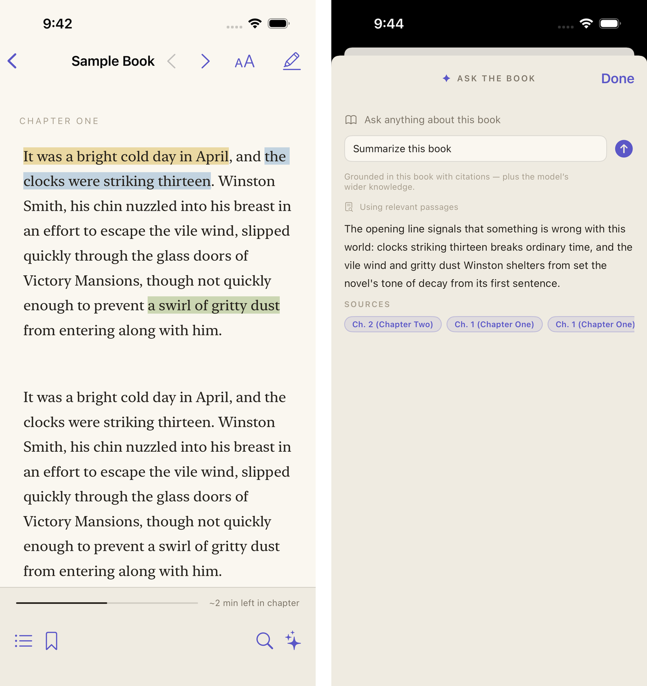
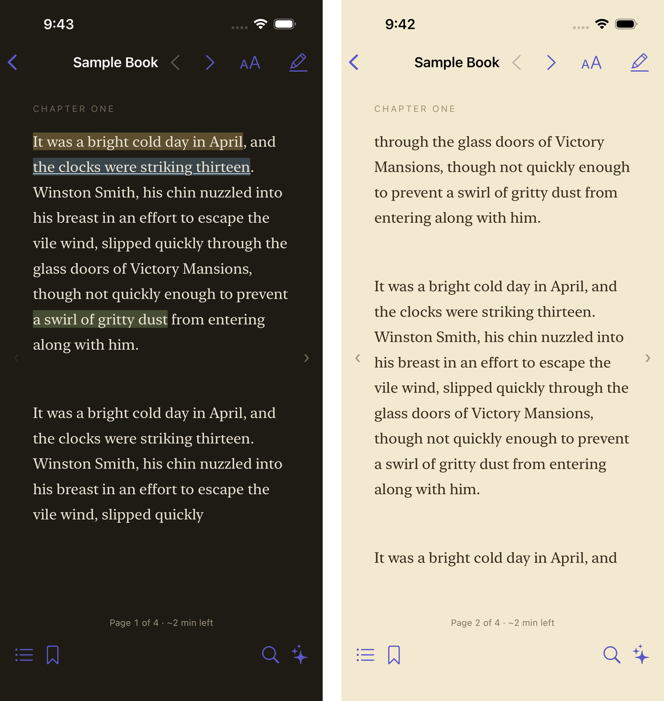
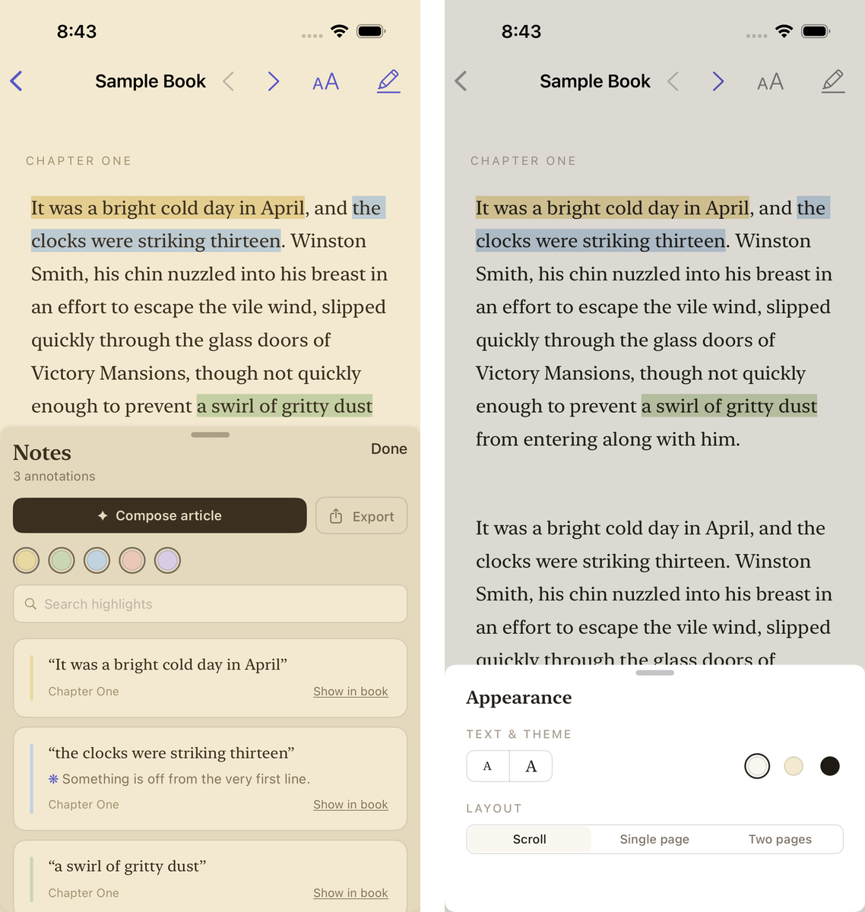
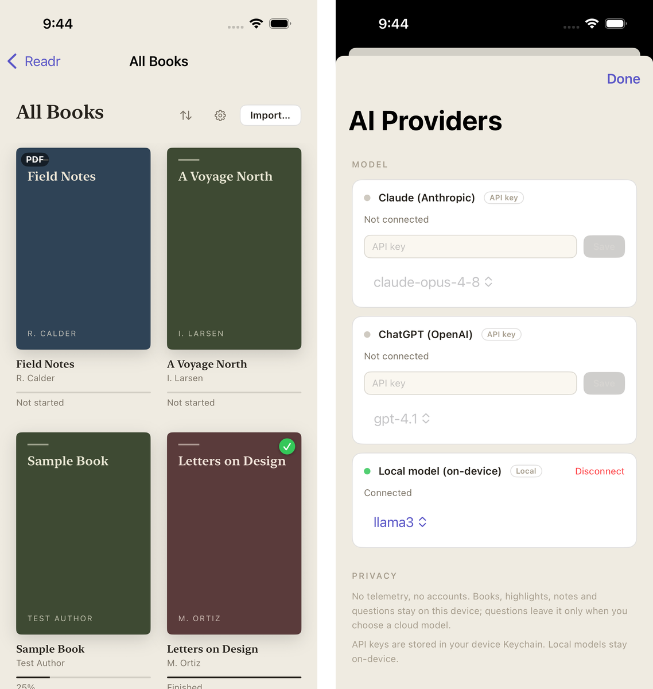
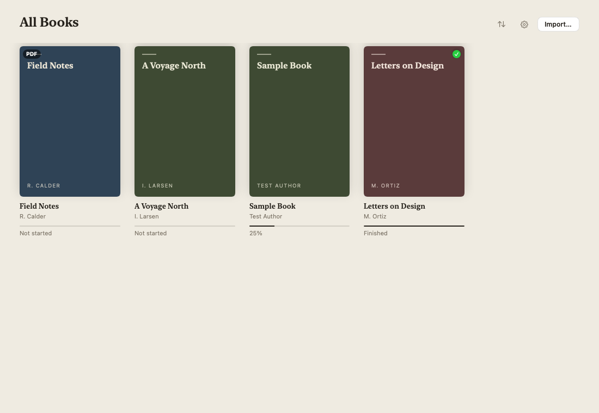
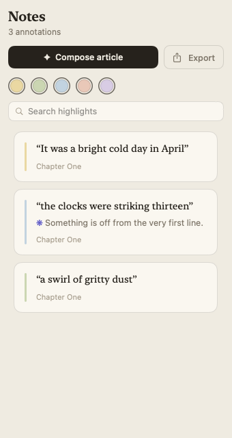

# Readr

[](https://github.com/readr-ai/readr/actions/workflows/ci.yml)
[](LICENSE)
[](#architecture)
[](Package.swift)

An AI-powered, native **macOS & iOS** ebook reader — think Apple Books, but you can
ask the book questions and turn your highlights into articles. Open source (MIT).



<p align="center">
  <a href="https://github.com/readr-ai/readr/releases/latest"><b>⬇️&nbsp;&nbsp;Download for macOS</b></a>
  &nbsp;·&nbsp;
  <a href="#installing-macos">Install notes (Gatekeeper)</a>
  &nbsp;·&nbsp;
  <a href="#building-from-source">Build from source</a>
</p>

> Status: **feature-complete core, pre-1.0.** All features below are implemented,
> unit/integration tested, and CI builds the app for macOS + iOS and runs the
> UI-test suite on a simulator. Remaining pre-1.0 work (real-provider smoke
> tests, richer EPUB styling) is tracked in [docs/ROADMAP.md](docs/ROADMAP.md).

## Why

When you read, you have questions. Today you copy a sentence, paste it into
Claude/ChatGPT, and ask. Readr removes that loop: select text → ask → get an
answer grounded in **the whole book**, without leaving the page. Your highlights
and notes can also be auto-composed into a shareable article.

## Features

- 📖 Native **EPUB**, PDF, and text/Markdown reading (DRM-free).
- 📄 **Three reading layouts**: continuous scroll, **single page**, or **two
  facing pages** like an open book — with page turns via buttons or arrow keys,
  reflowing on window resize (macOS).
- 🤖 **Ask the book**: select a sentence, ask a question, get a streamed answer
  with full book context and **source citations**.
- ✍️ **Highlights → article**: auto-compose your highlights and notes into an
  editable, exportable Markdown article (streams in live).
- 🔌 **Bring your own LLM**: paste an **Anthropic** or **OpenAI** API key, or
  run a **local LLM** (Ollama) fully offline.
- 🔒 Privacy-first: no telemetry or analytics code at all; local mode talks
  only to your local Ollama server; keys live only in the Keychain.

## Screenshots

| | |
|:---:|:---:|
|  |  |
| Paged reading in dark and sepia themes | Highlights & notes with **Compose article**; themes and layouts |
|  |   |
| Your library; connect Claude, OpenAI, or a local model | The same library and notes panel, native on macOS |

## How book context works

Readr uses an **adaptive tiered strategy** — small books are sent whole (with
prompt caching), large books use hybrid contextual retrieval, and local mode
always stays on-device. Full rationale and citations in
[docs/CONTEXT-STRATEGY.md](docs/CONTEXT-STRATEGY.md).

## Architecture

- **SwiftUI** multiplatform app (iOS 17+ / macOS 14+).
- **`ReadrKit`** — platform-agnostic Swift Package with the core logic (parsing,
  context router, RAG, LLM providers, article composer).
- Custom EPUB/text parsing in `ReadrKit`; **PDFKit** for native PDF rendering
  and markup on device.
- In-memory hybrid retrieval (BM25 + on-device embeddings) built per book on
  open; SQLite persistence is on the roadmap.

See [docs/ARCHITECTURE.md](docs/ARCHITECTURE.md).

## Planning

- [docs/USER-JOURNEYS.md](docs/USER-JOURNEYS.md) — the spec: user journeys +
  expected behaviour, as testable acceptance criteria.
- [docs/DEVELOPMENT-PLAN.md](docs/DEVELOPMENT-PLAN.md) — test-first milestone
  plan (tests written before code, verified against journeys after).
- [docs/AUTH.md](docs/AUTH.md) — how BYO keys and local models work, plus the
  subscription-OAuth design (currently disabled pending end-to-end
  verification).
- [docs/CONTEXT-STRATEGY.md](docs/CONTEXT-STRATEGY.md) — the adaptive
  whole-book-vs-retrieval decision.
- [docs/ROADMAP.md](docs/ROADMAP.md) — milestone checklist.

## Installing (macOS)

Grab `Readr.app` from the
[latest GitHub Release](https://github.com/readr-ai/readr/releases/latest)
(built by CI). The app is ad-hoc signed but **not notarized** (no Apple
Developer ID yet), so macOS shows a one-time *"Apple could not verify…"*
warning. To open it:

- **macOS 15 (Sequoia) or newer**: launch it once and click **Done**, then go to
  **System Settings → Privacy & Security**, find *"Readr" was blocked…*, and
  click **Open Anyway**.
- **macOS 13/14**: right-click `Readr.app` → **Open** → **Open**.
- **Terminal**: `xattr -d com.apple.quarantine /Applications/Readr.app`

Or build from source below — locally built apps don't get quarantined.

## Building from source

> Requires **macOS + Xcode 16+**. (The app cannot be built on Linux.)

```sh
brew install xcodegen
xcodegen generate      # produces Readr.xcodeproj from project.yml
open Readr.xcodeproj   # run the "Readr" scheme (macOS or iOS)
```

The core package alone builds anywhere Swift runs:

```sh
swift build
swift test
```

## Contributing

This is an open-source project — contributions welcome. See
[CONTRIBUTING.md](CONTRIBUTING.md). Licensed under [MIT](LICENSE).
